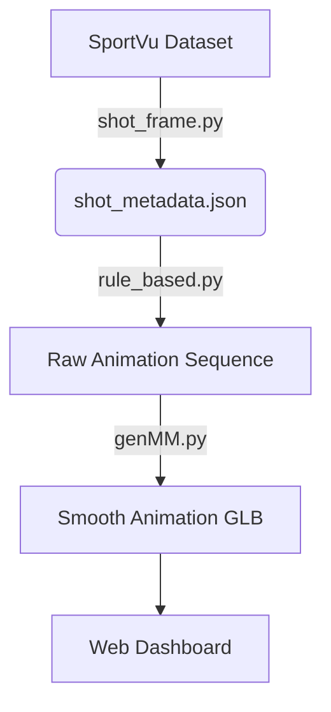

# 🏀 3D Reconstruction in Basketball: A Realistic Virtualisation of Basketball 3-Point Shooting from Sparse Open-Source Data


**Authors:** Tommaso Ballarini & Michele Lovato Menin

## Overview

This project presents a novel pipeline for the **realistic virtualization of basketball 3-point shooting** using *sparse* open-source data.

Commercial leaders in sports analytics (like Genius Sports or Beyond Sports) typically rely on expensive, hardware-intensive optical tracking systems to extract dense skeletal data. Our approach democratizes this technology by synthesizing realistic 3D actions from **single-point 2D tracking data** (X, Y coordinates of players and X, Y and Z of the ball) from the NBA 2015-2016 season.

By leveraging ball dynamics to logically infer missing player motion and applying **Generative Motion Matching (GenMM)**, we transform raw tracking data into coherent, smooth 3D animations without the need for proprietary datasets.

## Key Features

* **Sparse-to-Dense Reconstruction:** Generates complex 3D representations using only 2D positions and open-source datasets.
* **Motion Smoothing:** Implements a custom **GenMM** script based on *Li et al. (2023)* to ensure fluid transitions between animation states.
* **Interactive Web Dashboard:** A Flask-based web application allowing users to filter shots (Player, Team, Game) and view results on a 2D tactical board.
* **Immersive 3D Viewer:** View any reconstructed shot from a 360° controllable camera angle directly in the browser.
* **Historical Reenactment:** Recreates specific actions from the 2015-16 NBA season using the SportVu dataset.

---

## Architecture & Pipeline

The system operates on a rule-based logic implementation that maps 2D coordinates to a library of MOCAP-style animations.



### 1. Data Extraction & Logic
We use the **SportVu** dataset(HiggingFace).

* **Standard Extraction (`shot_frame.py`):**
  This script iterates through game data to identify 3-point shot events. It extracts the "shot frame," the shooter's ID, and the XY coordinates of the player and XYZ coordinates of the ball. It assumes the shooter belongs to the team currently labeled with "possession."

* **Robust Fallback (`shot_frame_adj.py`):**
  We developed this adjusted script to handle data inconsistencies, such as timestamp misalignments (e.g., a shot labeled at event index 189 that actually occurs at 188). Unlike the standard script, this version scans **all 10 players** on the court—rather than just the offensive 5—to identify the true shooter based on proximity to the ball. This ensures the correct player is animated even if the possession label is flawed.

**Output:** Both scripts generate `shot_metadata.json` (for the current specific action) and append the entry to `shots_data.json` (the cumulative database used by the frontend).

### 2. Rule-Based Reconstruction (Blender)
The core virtualization takes place in **Blender** using the `rule_based.py` script.
* **Action Window:** The system generates a coherent 5-second sequence around the shot frame: **3 seconds pre-shot** and **2 seconds post-shot**.
* **Logic:** It maps the sparse 2D coordinates to a library of MOCAP-style animations. Crucially, the script places these animation blocks on the timeline but intentionally leaves small **gaps (approx. 10 frames)** between distinct movements. These gaps are reserved for the subsequent smoothing phase.

### 3. Motion Synthesis (GenMM Integration)
To eliminate robotic transitions and foot sliding, we integrate a custom script: `genMM.py`.
* **Technique:** This script applies **Generative Motion Matching**, utilizing "Motion-in-Betweening" to intelligently fill the 10-frame gaps left by the rule-based logic.
* **Result:** The system synthesizes fluid, physically realistic transitions between the pre-shot dribble, the jump shot, and the landing, creating a continuous 3D mesh. The final result is exported as a `.glb` file.

### 4. Web Visualization
* The final output is a `.glb` file.
* The web platform reads `shots_data.json`to poplate the dashboard and renders the 3D files.

## Installation

### Prerequisites
* **Python 3.8+**
* **Blender 3.x** (Ensure `bpy` is accessible or run scripts within Blender's scripting tab)
* **Dependencies:**
    Install the required Python packages using pip:
    ```bash
    pip install pandas numpy flask
    ```

### Dataset Setup
1.  **Download Data:** Acquire the **NBA Tracking Data (2015-16)** from HuggingFace:
    [HuggingFace Dataset Link](https://huggingface.co/datasets/dcayton/nba_tracking_data_15_16?)
    For simplicity, you can install the tiny format (only 5 matches).
3.  **Placement:** Place the dataset in the root directory (or ensure the paths in `shot_frame.py` match your local folder structure).

---

## Usage

This project supports two modes: **User Mode** (for visualizing existing data) and **Developer Mode** (for generating new 3D animations).

### User Mode (Web Visualization)
To explore the interactive dashboard and view previously reconstructed shots:

1.  **Start the Backend:**
    ```bash
    python backend.py
    ```
2.  **Start the Frontend:**
    ```bash
    python frontend.py
    ```
3.  **Access the Dashboard:**
   
    Open your browser to `http://localhost:5000` (or the port specified in the terminal). You will see a 2D view of the court. Markers indicate shot locations: **X** (Missed) and **O** (Made). Use the dropdown menu to filter shots by Player, Team, or Game ID. Click on any marker to load the **360° interactive 3D viewer** for that specific action.

### Developer Mode
To reconstruct a new action from raw data, follow this pipeline:

#### Step A: Data Extraction
Run the extraction script to identify the shot frame and isolate tracking data.
```bash
python shot_frame.py
```

* **Robust Fallback (`shot_frame_adj.py`):**
    Use this script when the action data is misaligned (e.g., the "3pt shot" label appears at event index 189, but the actual data is at 188).
    * *Why use it?* Sometimes the dataset's possession label is incorrect for the specific frame.
    * *How it works:* Unlike the standard script which looks for the shooter among the 5 offensive players, this script scans **all 10 players** on the court. It identifies the shooter based on proximity to the ball, ensuring the correct player is selected even if the possession data is flawed.

**Output:** Both scripts update `shot_metadata.json` (current action data) and append the result to `shots_data.json` (historical database).

#### Step B: Blender Reconstruction
1.  **Open Blender:** Launch Blender manually.
2.  **Load Environment:** Open the `basket_ambient.blend` file.
3.  **Run Script:** run `rule_based.py`.
    * *Process:* This script reads the `shot_metadata.json` file generated in Step A.
    * *Logic:* It constructs a **5-second animation window** (3 seconds before the shot, 2 seconds after). It places the animations on the timeline using rule-based logic, intentionally leaving small gaps (approx. 10 frames) between animation blocks to be filled in the next step.

#### Step C: Motion Synthesis (GenMM)
Once the base animation is arranged in Blender, run the smoothing script:
```bash
python genMM.py
```

* **Logic:** This script integrates the **Generative Motion Matching (GenMM)** algorithm. It applies "Motion-in-Betweening" to smooth the 10-frame gaps left by the rule-based script. This ensures the player's movement is fluid and physically coherent, removing robotic transitions or sliding artifacts.
* **Final Output:** The script exports the finished animation as a `.glb` file into the web assets folder, ready for the dashboard.

---

## References

### Motion Synthesis
The smoothing algorithm utilizes **Generative Motion Matching** to ensure realistic human movement.

> **Li, W., Chen, X., Li, P., Sorkine-Hornung, O., & Chen, B. (2023).**
> *Example-based motion synthesis via generative motion matching.*
> ACM Transactions on Graphics (TOG), 42(4), 1-12.

---

## 📄 License
This is an open-source academic project.

